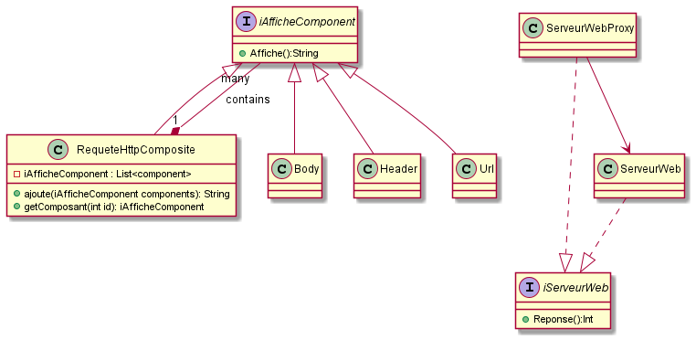

# design-pattern

Second rendu du cours de Design pattern.

# Diagrame UML 

# Explication des Design pattern

Utilisation de :

- Composite 
- Proxy

Composite est utilisé dans le cadre de la création de la requête HTTP, en effet, la requête est composé de 3 élément : body, url et header.

Comme sur le principe du dessin, on viens ajouter ces éléments dans la requête.
On utilise ensuite l'affichage pour afficher les élements ajouter

Proxy est utilisé dans le cadre du renvoi du code 200, 500 et 403
puisqu'on cherche particulièrement l'élément 403, on place un barage à cet élément particulier (evilurl). Si il ne trouve pas evilurl, on fait le fonctionnement normal de serveurweb 