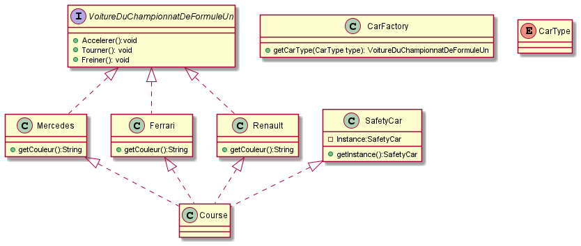

# design-pattern

Premier rendu du cours de Design pattern.

# Diagrame UML 

# Explication des Design pattern

Utilisation de :

- Factory 
- Singleton

Factory est utilisé pour la structure de création des voiture, afin de créer une ferrari, une mercedes, une renault, à partie de l'énumération des constructeur TypeCar. On part de l'interface avec les méthode à utiliser qui sont passé à la classe Car
Singleton est utilisé pour la safety car, il n'existe qu'une safety car pour la course